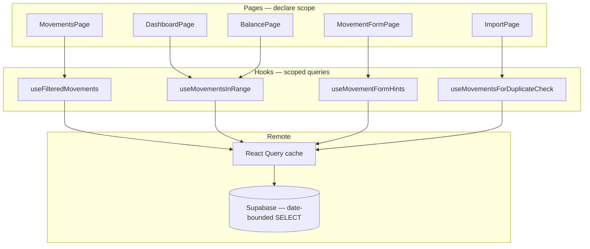

# Scoped movement queries — implementation sketch

## Problem

Today remote mode does:

```
login → prefetch ALL movements → every page reads same blob → filter/sort in JS
```

That fixed the sort bug (paginate-before-sort), but mobile pays for a full-table download before any number appears.

**Invariant to preserve:** filter → sort globally → paginate (UI slice). Never `LIMIT 30` before sort.

---

## Target architecture



**Rule:** no page calls `useMovements()` (full list). Each hook fetches only what it needs.

---

## Phase 1 — quick wins (recommended first PR)

Scope: remote mode only; local Dexie keeps current paths (already fast).

### 1. Repository: date-bounded list

**`src/lib/repositories/types.ts`**

```ts
export interface MovementDateRange {
  dateFrom: string // ISO date YYYY-MM-DD
  dateTo: string
}

export interface MovementRepository {
  list(): Promise<Movement[]> // keep for backup/migration/stats; stop using in UI
  listInRange(range: MovementDateRange): Promise<Movement[]>
  // ... rest unchanged
}
```

**`src/lib/repositories/supabase-repositories.ts`**

```ts
async listInRange({ dateFrom, dateTo }: MovementDateRange) {
  const { data, error } = await supabase
    .from('movements')
    .select('*')
    .eq('couple_id', coupleId)
    .gte('date', dateFrom)
    .lte('date', dateTo)
    .order('date', { ascending: false })

  if (error) throw error
  return (data ?? []).map(rowToMovement)
}
```

**Dexie parity** — thin wrapper over existing index:

```ts
async listInRange({ dateFrom, dateTo }: MovementDateRange) {
  return db.movements
    .where('date')
    .between(dateFrom, dateTo, true, true)
    .reverse()
    .toArray()
}
```

### 2. Query keys — scope in the key

**`src/lib/query/keys.ts`**

```ts
export const queryKeys = {
  // ...
  movementsInRange: (coupleId: string, dateFrom: string, dateTo: string) =>
    ['movements', coupleId, dateFrom, dateTo] as const,
  movementById: (coupleId: string, id: string) =>
    ['movement', coupleId, id] as const,
  movementFormHints: (coupleId: string) =>
    ['movementFormHints', coupleId] as const,
}
```

Drop global `movements(coupleId)` from prefetch. Invalidate with prefix:

```ts
queryClient.invalidateQueries({ queryKey: ['movements', coupleId] })
```

### 3. Hook: period-scoped movements

**`src/hooks/useData.ts`** — new hook:

```ts
export function useMovementsInRange(range: MovementDateRange | undefined) {
  const { mode, repos, coupleId } = useDataContext()

  const local = useLiveQuery(
    () => (range ? repos.movements.listInRange(range) : []),
    [range?.dateFrom, range?.dateTo, repos],
  )

  const remote = useRemoteQuery(
    queryKeys.movementsInRange(
      coupleId ?? 'local',
      range?.dateFrom ?? '',
      range?.dateTo ?? '',
    ),
    () => repos.movements.listInRange(range!),
    { enabled: !!range },
  )

  return mode === 'local' ? (local ?? []) : (remote.data ?? [])
}
```

### 4. Fix `useFilteredMovements` (MovementsPage)

**Remote path today:** `list()` → filter/sort all history in memory.

**Remote path after:**

```ts
const range = {
  dateFrom: filters.dateFrom ?? currentMonthRange().from,
  dateTo: filters.dateTo ?? currentMonthRange().to,
}

const movementsQuery = useRemoteQuery(
  queryKeys.movementsInRange(coupleId!, range.dateFrom, range.dateTo),
  () => repos.movements.listInRange(range),
)

const remoteFiltered = useMemo(() => {
  if (mode !== 'remote' || movementsQuery.data === undefined) return undefined
  // Same as today — sort/filter on the IN-RANGE set only
  return { ...filterAllMovementsInMemory(movementsQuery.data, filters, searchContext), queryKey }
}, [...])
```

**Sort by amount:** still computed in JS, but on ~1 month of rows instead of full history. Correct globally within the selected period.

**Wider period:** user picks "last 12 months" → one larger fetch, still bounded. Acceptable.

### 5. Page migrations (Phase 1)

| Page | Today | After Phase 1 |
|------|-------|---------------|
| **MovementsPage** | `useFilteredMovements` over full list | `listInRange(period)` + in-memory sort ✅ |
| **DashboardPage** | `useMovements()` | `useMovementsInRange(period)` + `useMovementsInRange(previousPeriod)` |
| **CategoriesPage** | `useMovements()` | `useMovementsInRange(period)` + previous period |
| **BudgetPage** | `useMovements()` | `useMovementsInRange(monthOfBudgetNavigator)` |
| **BalancePage** | `useMovements()` always | `useMovementsInRange` when scope ≠ `all`; lazy full list only for `all` |
| **MovementFormPage** | `useMovements()` | `useMovementFormHints()` (see below) + `getById(id)` for edit |
| **ImportPage** | `useMovements()` | `useMovementsInRange(importDateSpan)` for dupes + hints |

### 6. MovementFormPage — stop loading everything

Form needs:

- edit: one movement → `getById` (already on repo)
- frequent categories → recent history, not all time

**New repo method (optional, or reuse range):**

```ts
// Last 90 days is enough for getFrequentCategoryIds
listRecent(days = 90): Promise<Movement[]>
```

**Hook:**

```ts
export function useMovementFormHints() {
  const range = useMemo(() => rollingDaysRange(90), [])
  return useMovementsInRange(range)
}

export function useMovement(id: string | undefined) {
  const { repos, coupleId, mode } = useDataContext()
  const remote = useRemoteQuery(
    queryKeys.movementById(coupleId!, id!),
    () => repos.movements.getById(id!),
    { enabled: !!id },
  )
  // local: useLiveQuery(() => db.movements.get(id), [id])
}
```

**MovementFormPage changes:**

```ts
const hints = useMovementFormHints()           // ~90 days
const editMovement = useMovement(id)           // single row
// remove useMovements()
```

### 7. ImportPage — dupes scoped to import dates

When parsing file, compute span:

```ts
const dates = rows.map(r => r.date)
const range = { dateFrom: min(dates), dateTo: max(dates) }
const candidates = useMovementsInRange(range)
// isDuplicateMovement only against candidates
```

For `getFrequentCategoryIds`, reuse `useMovementFormHints()` or same 90-day range.

### 8. Stop prefetching full movements on login

**`src/contexts/DataContext.tsx` — `RemoteDataSync`**

Remove:

```ts
queryClient.prefetchQuery({ queryKey: queryKeys.movements(coupleId), ... })
```

Keep prefetch for settings, categories, budgets (small).

Optionally prefetch **current month only**:

```ts
const { from, to } = currentMonthRange()
queryClient.prefetchQuery({
  queryKey: queryKeys.movementsInRange(coupleId, from, to),
  queryFn: () => repos.movements.listInRange({ dateFrom: from, dateTo: to }),
})
```

Dashboard feels fast; MovementsPage default period is warm.

### 9. `useCoreDataLoading`

Replace movements leg:

```ts
// Before: isInitialRemoteLoad(movements) on full list
// After:  isInitialRemoteLoad(settings) || categories only
//        OR current-month range if dashboard requires it
```

Movements list loading stays local to MovementsPage skeleton (already there).

---

## Phase 2 — harder scopes (later)

| Need | Approach |
|------|----------|
| Balance scope = **all** | Lazy `list()` only when user picks "all"; show spinner; cache result |
| Import dupes across years | Expand range ±7 days around each row, or server RPC `find_duplicate_candidates` |
| Sort by amount at 10k+ rows/month | Postgres computed column `display_amount_ars` + index; or accept in-memory for bounded range |
| Settings stats (`useDatabaseStats`) | `repos.getStats()` with `COUNT(*)` query, not `list().length` |
| Personal view filter | stays in JS until you model share rules in SQL |

---

## BalancePage detail (lazy full load)

```ts
const [scope, setScope] = useState<BalanceScope>('current_month')

const periodRange = scope === 'all' ? undefined : scope === 'current_month'
  ? currentMonthRange()
  : customPeriod

const scopedMovements = useMovementsInRange(periodRange)
const allMovements = useMovements(scope === 'all') // new: enabled only when scope === 'all'
```

`useMovements` becomes a thin wrapper:

```ts
export function useMovements(options?: { enabled?: boolean }) {
  // remote: list() with enabled flag — used rarely (balance all, settings stats)
}
```

---

## Invalidation (unchanged mental model)

Realtime still fires on `movements` table. On event:

```ts
queryClient.invalidateQueries({ queryKey: ['movements', coupleId] })
```

All range caches for that couple refetch in background. `placeholderData` keeps UI stable.

---

## File checklist (Phase 1)

```
src/lib/repositories/types.ts          + MovementDateRange, listInRange
src/lib/repositories/supabase-repositories.ts   + listInRange
src/lib/repositories/dexie-repositories.ts      + listInRange
src/lib/query/keys.ts                  + movementsInRange, movementById
src/hooks/useData.ts                   + useMovementsInRange, useMovement, useMovementFormHints
                                       ~ useFilteredMovements (remote path)
                                       ~ useCoreDataLoading
src/contexts/DataContext.tsx         ~ prefetch current month, not all
src/pages/DashboardPage.tsx          useMovementsInRange
src/pages/CategoriesPage.tsx         useMovementsInRange
src/pages/BudgetPage.tsx             useMovementsInRange
src/pages/BalancePage.tsx            scoped + lazy all
src/pages/MovementFormPage.tsx       useMovement + useMovementFormHints
src/pages/ImportPage.tsx             range from parsed dates
src/lib/utils.ts                     + rollingDaysRange(90) helper (optional)
```

**Tests to add:**

- `listInRange` filters correctly (Dexie integration)
- `useFilteredMovements` remote: sort by amount applies to full in-range set, not first 30
- query key includes dateFrom/dateTo so period change triggers refetch

---

## Expected impact

| Scenario | Before | After Phase 1 |
|----------|--------|---------------|
| Open app on mobile | Download all movements | Download ~current month |
| Dashboard totals | Wait for full list | Wait for period range (~same as visible data) |
| Sort by amount on Movements | Correct (full history) | Correct within selected period |
| Balance "all time" | Instant (already in memory) | One explicit fetch when selected |
| Edit movement | Loads all to find one row | Single `getById` |

---

## What we are NOT doing

- ❌ Supabase `LIMIT 30 ORDER BY amount` without fetching the filtered set first
- ❌ Removing in-memory sort for amount/category/personal view (Phase 1)
- ❌ Breaking local mode (Dexie stays; same hook API)

---

## Suggested PR order

1. **Repo + keys + `listInRange`** — no UI change, tests green ✅ (2026-06-15)
2. **Dashboard + Categories + Budget** — swap to `useMovementsInRange`; remove movements from prefetch ✅ (2026-06-15)
3. **MovementsPage** — wire `useFilteredMovements` to range query ✅ (2026-06-15)
4. **MovementFormPage + ImportPage** — hints + getById ✅ (2026-06-15)
5. **BalancePage lazy all** — scoped by default; full list only for Histórico ✅ (2026-06-15)

Each PR is shippable; mobile improves after PR 2.
