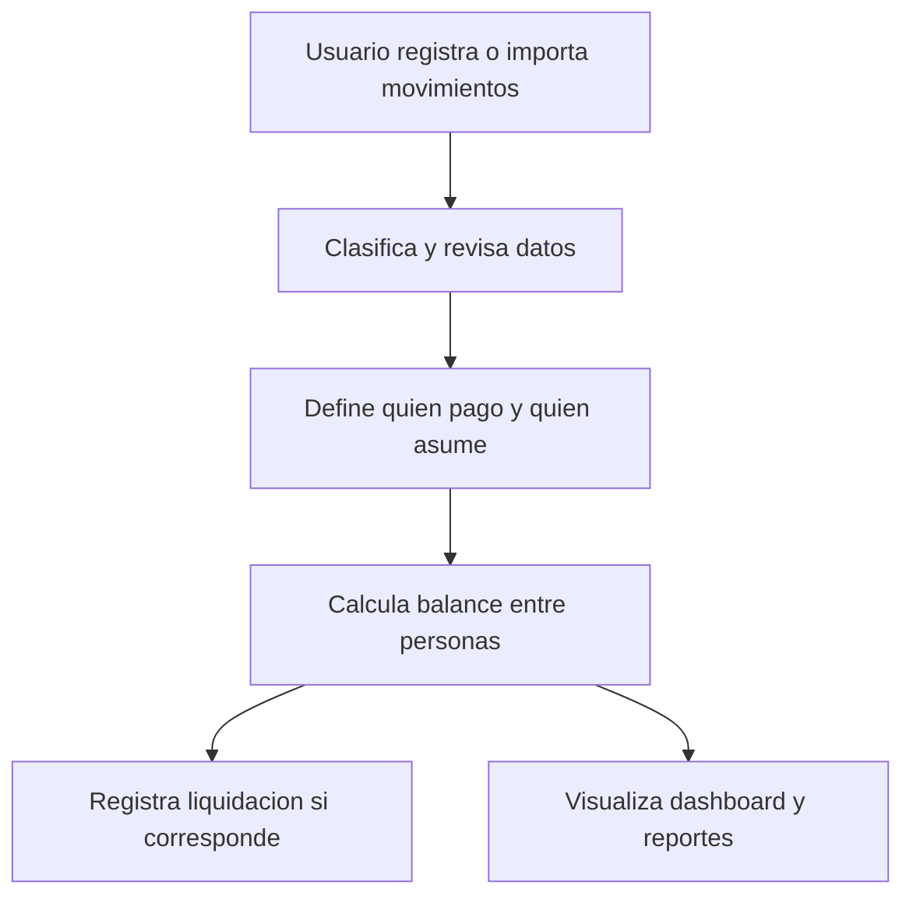

# Plan De Implementacion: App De Finanzas De Pareja

## Objetivo

Implementar una aplicacion web responsive, usable desde desktop y movil, para gestionar las finanzas de una pareja. La app debe ayudar a registrar movimientos, entender el balance economico, visualizar gastos, simplificar la carga diaria, importar resumenes de cuentas y calcular diferencias entre lo que cada persona pago y lo que le correspondia asumir.

La primera version debe ser simple, util y extensible. No debe intentar resolver todo el producto final, pero si debe dejar bien modeladas las bases para agregar presupuestos, metas, gastos recurrentes, reglas de categorizacion y sincronizacion en futuras iteraciones.

## Prompt Para Una Futura Sesion

```text
Quiero que implementes una aplicacion web responsive para gestionar las finanzas de mi pareja y mias.

Objetivo del producto:
Ayudarnos a mejorar el seguimiento financiero, tomar decisiones mas inteligentes, simplificar el registro diario de movimientos, visualizar nuestra situacion economica, importar gastos desde resumenes de cuentas y planificar mejor el manejo del dinero compartido e individual.

Alcance del MVP:
- Registrar ingresos y gastos.
- Clasificar movimientos por categoria.
- Distinguir entre movimientos personales y compartidos.
- Indicar quien pago cada gasto: persona A, persona B o ambos.
- Indicar quien debe asumir cada gasto: persona A, persona B, ambos o porcentajes personalizados.
- Permitir definir el porcentaje del gasto que asume cada persona, por ejemplo 50/50, 70/30 o 100/0.
- Calcular el balance entre ambos: cuanto pago cada persona, cuanto le correspondia asumir y quien le debe a quien.
- Permitir registrar una liquidacion o pago de compensacion para saldar la diferencia entre ambos.
- Ver balance general del periodo.
- Ver total de ingresos, total de gastos y saldo neto.
- Ver gastos por categoria.
- Filtrar movimientos por fecha, categoria, tipo, persona, origen y si son compartidos o personales.
- Editar y eliminar movimientos.
- Importar movimientos desde resumenes de tarjeta de credito y cuenta debito.
- Permitir revisar, categorizar y confirmar los movimientos importados antes de guardarlos.
- Evitar duplicados al importar movimientos repetidos.
- Tener una interfaz clara, rapida y usable desde movil.

No incluir todavia en el MVP:
- Integraciones bancarias automaticas o conexion directa con bancos.
- Inteligencia artificial real.
- Sincronizacion externa.
- Multiusuario avanzado con permisos complejos.
- Presupuestos, metas, deudas o alertas, salvo que quede una base simple preparada para agregarlos despues.

Preferencias tecnicas:
- Si no existe un proyecto todavia, crea uno nuevo con una estructura moderna y simple.
- Usa TypeScript.
- Usa un stack web actual, estable y facil de mantener.
- Prioriza una experiencia responsive mobile-first.
- Usa persistencia local o base de datos simple, segun lo que sea mas razonable para el entorno del proyecto.
- Manten el codigo limpio, modular y preparado para crecer.
- Para la importacion de resumenes, prioriza formatos simples y confiables como CSV o Excel.
- Si necesito importar PDF, pideme un ejemplo real o define una estrategia explicita de extraccion antes de implementar.
- No envies datos financieros a servicios externos sin aprobacion explicita.

Modelo de datos minimo:
- Persona: id, nombre.
- Categoria: id, nombre, tipo sugerido ingreso/gasto, color opcional.
- Movimiento: id, tipo ingreso/gasto/liquidacion, monto, fecha, descripcion, categoria, persona que pago, porcentaje asumido por persona A, porcentaje asumido por persona B, indicador de compartido, fuente manual/importada, fecha de creacion y fecha de actualizacion.
- Importacion: id, tipo de cuenta credito/debito, nombre de archivo, fecha de importacion, cantidad de movimientos detectados, cantidad confirmada y estado.
- Movimiento importado pendiente: id, fecha, descripcion original, monto, comercio o referencia si existe, categoria sugerida, posible duplicado y estado pendiente/confirmado/ignorado.

Pantallas minimas:
- Dashboard con resumen del mes o periodo seleccionado.
- Lista de movimientos con filtros.
- Formulario para crear y editar movimiento.
- Vista o seccion de analisis por categoria.
- Vista de balance entre personas: pagado por cada uno, asumido por cada uno, diferencia y accion para registrar liquidacion.
- Flujo de importacion de resumen: subir archivo, previsualizar movimientos, mapear columnas si hace falta, categorizar, detectar duplicados y confirmar.
- Configuracion simple para nombres de las dos personas y categorias base.

Requisitos de UX:
- El registro de un gasto debe ser rapido.
- Los totales importantes deben verse sin esfuerzo.
- El balance de quien pago, quien debia asumir y quien debe compensar debe ser muy claro.
- La importacion debe ser revisable antes de impactar los datos reales.
- La navegacion debe funcionar bien en pantallas pequenas.
- Usa estados vacios claros cuando no haya datos.
- Evita sobrecargar la interfaz con funciones futuras.

Proceso de trabajo:
1. Primero inspecciona el workspace y detecta si ya existe un proyecto.
2. Si no hay proyecto, preguntame el nombre y ubicacion antes de crearlo.
3. Propone brevemente el stack y la estructura antes de implementar si hay mas de una opcion razonable.
4. Implementa el MVP de forma incremental.
5. Anade datos semilla o ejemplos para poder probar la app rapidamente.
6. Implementa primero el registro manual y los calculos de balance entre personas.
7. Despues implementa la importacion de resumenes, empezando por CSV o Excel salvo que confirmemos otro formato.
8. Anade validaciones basicas para montos, fechas, tipo, categoria, porcentajes de distribucion y duplicados importados.
9. Anade pruebas o una verificacion minima proporcional al alcance, especialmente para el calculo de balances y liquidaciones.
10. Al finalizar, explicame como ejecutar la app y que quedo listo para futuras iteraciones.

Criterios de aceptacion:
- Puedo registrar ingresos y gastos.
- Puedo marcar movimientos como personales o compartidos.
- Puedo indicar quien pago cada gasto.
- Puedo definir que porcentaje del gasto asume cada persona.
- Puedo ver cuanto pago cada persona, cuanto debia asumir y quien debe compensar a quien.
- Puedo registrar una liquidacion para saldar la diferencia.
- Puedo ver el balance total, ingresos, gastos y saldo neto.
- Puedo ver gastos agrupados por categoria.
- Puedo filtrar y revisar movimientos historicos.
- Puedo importar movimientos desde resumenes de tarjeta de credito o cuenta debito.
- Puedo revisar y confirmar los movimientos importados antes de guardarlos.
- La app detecta o ayuda a evitar duplicados al importar.
- La app funciona correctamente en mobile y desktop.
- El codigo queda organizado para agregar presupuestos, metas y planificacion en una segunda etapa.
```

## Enfoque Recomendado

Empezar con un MVP local y funcional antes de agregar autenticacion, sincronizacion o automatizaciones. La prioridad es que el registro manual, el calculo de saldos y la importacion revisable funcionen bien.

La interfaz debe girar alrededor de cuatro acciones principales:

- Registrar movimientos.
- Importar resumenes.
- Revisar y analizar gastos.
- Saldar diferencias entre personas.

## Flujo Principal



## Futuras Iteraciones

- Presupuestos mensuales por categoria.
- Metas compartidas, como ahorro, viajes o fondo de emergencia.
- Gastos recurrentes.
- Alertas o insights simples.
- Reglas automaticas para categorizar importaciones recurrentes.
- Soporte para formatos especificos de bancos o tarjetas.
- ~~Autenticación y sincronización multi-dispositivo.~~ **Hecho (Fase 2, Supabase)**
- ~~Deploy a producción (Vercel).~~ **Hecho (Fase 3)** — https://finanzas-personales-ebon.vercel.app
- ~~Importaciones en nube.~~ **Hecho (Fase 4)**
- ~~Códigos de invitación con expiración/revocación.~~ **Hecho (Fase 4)**
- ~~Identidad por cuenta (nombres desde perfiles, Yo/Mi pareja).~~ **Hecho (Fase 4.1)**

## Estado Del Proyecto (actualizado)

| Fase | Estado |
|------|--------|
| MVP local (IndexedDB) | Completado |
| Fase 2 — Supabase, auth, pareja, sync movimientos/categorías/settings | Completado (local + prod) |
| Fase 3 — Deploy Vercel | Completado — https://finanzas-personales-ebon.vercel.app |
| Fase 4 — Importaciones en nube + códigos de invitación | Completado (local + prod) |
| Fase 4.1 — Identidad por cuenta (perfiles, Yo/Mi pareja, migración 005) | Completado (local + prod) |
| Presupuestos, metas, offline-first | **Próxima sesión de código** |

Estado vivo y prompt siguiente sesión: `NEXT.md` · historial: `docs/history/CHANGELOG.md`. Deploy y URL: `README.md`.

